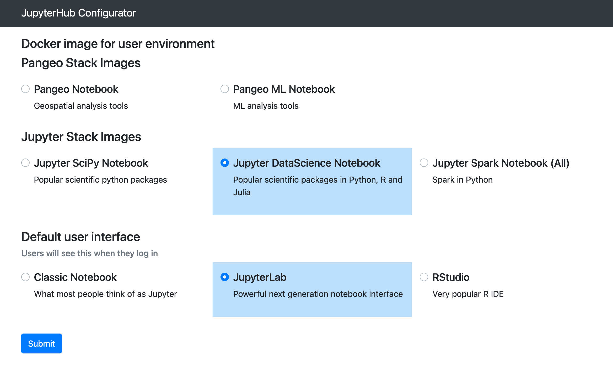

# jupyterhub-configurator

Let admins configure their JupyterHub via a GUI

If specifying a custom image in the GUI below, be sure to include the tag in the repository name(e.g. <image_repo> : \<tag\> ). Also, note that when clicking the "Submit" you will not see any feedback saying the submission is successful. Just trust it, it works!

